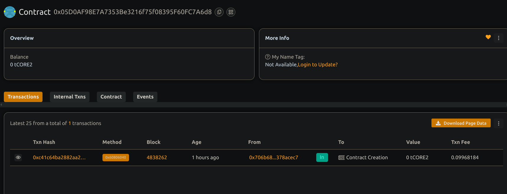

# Asset Tokenization Platform for Real-World Assets

## 📖 Project Description

A decentralized platform to tokenize real-world assets as NFTs. Each token represents ownership or certification of a real-world asset, such as real estate, artwork, or physical goods, recorded on the blockchain with metadata references.

## 🌍 Project Vision

To bridge the gap between the physical and digital economies by enabling secure, transparent, and verifiable tokenization of real-world assets using smart contracts.

## 🔑 Key Features

- ERC721-based NFT for each unique asset
- Metadata URI for off-chain documentation (proof, certificates)
- Ownership tracking and transferability
- Verifiable history of asset issuance.

## 🚀 Future Scope

- Integration with oracles for real-world validation
- Support for fractional ownership via ERC20 tokens
- On-chain verification of asset authenticity
- DeFi lending/borrowing using tokenized assets as collateral
- Legal compliance and KYC module integration

## Contract details
0x05D0AF98E7A7353Be3216f75f08395F60FC7A6d8
